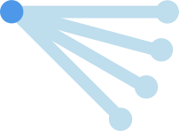
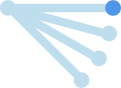
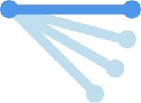

# Managing relationships

## Introduction

CouchDB does not provide an implicit mechanism for establishing relationships between records, or for indicating that a referenced record must exist.

This package enables you to model relationships between documents using a new relationship document type, as outlined below.

It cannot provide any real equivalent of "foreign key constraints", you are expected to handle this in your own code by (for example):

1. Confirming that all records described in a relationship document exist before creating it.
2. Checking to see if a record has relationships before deleting it.
3. Creating reports to display records that lack a "required" relationship.
4. Creating reports to display relationship documents that refer to non-existent records.

## What types of relationships do we need to represent?

Our core use cases for using relationships are manifold, but here are a few key examples:

## One to many relationships

In the Unified Listing, we need to represent the relationship of user-contributed content to curated "unified" records.  In the Preference Terms Dictionary, we need to represent the relationship between "common" terms and variations on those terms ("aliases").  These are one-to-many relationships.

In both use cases, a "child" record is only ever associated with one "parent".  We also want to represent "compound terms" in the Preference Terms Dictionary.  These are terms which are composed of simpler related records.  For example, we may collect metadata about the concept of "uppercase pitch", and we want to indicate that it is related to the concept of "uppercase" and also the concept of "pitch".  The concept of "pitch" may also be referenced in a "lowercase pitch" entry.

## One to one relationships

We are considering one-to-one relationships to be a subset of one-to-many relationships, where the number of the "many" is exactly one.  We will use the same approach for this case.

## "group" relationships

We also have a number of use cases for records that all relate to one another equally.  For example, a group of related records.

This type of relationship document does not describe how one record relates to others.  Instead, the relationship document describes how other documents relate to the relationship document itself.  The relationship document itself may contain simple metadata, such as a group name.

## "Shallow" relationships.

At the moment we only represent shallow (one level) relationships between records.  This satisfies all of our current use cases and avoids unnecessary complexity.

## What is a relationship document?

In order to minimize the number of retrievals, it is preferable to represent a relationship in terms of the CouchDB `_id` values of the records involved.  If this is done, you can use the `include_docs` parameter to retrieve the related documents in a single query against a CouchDB view endpoint (including [lists](http://guide.couchdb.org/draft/transforming.html)).  This will only work for records that are part of the same database.

Although it is possible to store relationship information as part of our normal "content" documents, our review model makes that less advisable.  In both the PTD and UL, we have a carefully curated set of records.  We would like to allow people to express relationships between those records without giving them write access to the original records.  Although we could manage this in code, it is simpler and safer to store the relationship data in another record, which we will call a relationship document.

# Looking up records

In order to present a seamless set of records, we need to retrieve the full document content for all related parties.

## Looking up individual records

For individual records, the lookup is fairly simple.  We may be starting from a central point ("common term", for example) and looking for its "children" ("aliases", in the PTD).

We might also be viewing a "child" record and want to see both our "parents" and siblings.

In these cases we can:

1. Retrieve the set of related records using a {{startKey}} and {{endKey}} range and a view indexed using multi-value keys.
2. Weave the content together using either a CouchDB list function or javascript code.

## Looking up sets of records

Both the UL and PTD offer a search, which returns a raw list of all record types.  We are given a list of records which may be "parents" or "children", and we need to knit them together into a sensible list of parents and their children.  This immediately increases the complexity because we cannot limit a CouchDB view request by multiple ranges.  We could use a CouchDB list and pass the list of "parent" IDs as keys, but in our testing lists are not performant enough.

Instead, we propose having all searches return a list of matching IDs, and then looking up the record content using a large list of keys.  This brings us to the 8,000 character limit for CouchDB API requests.  We can only send 8,000 bytes of character data per request, including any other query parameters.  For searches with many matches, our options are either to only retrieve a subset of records, or to issue multiple queries.